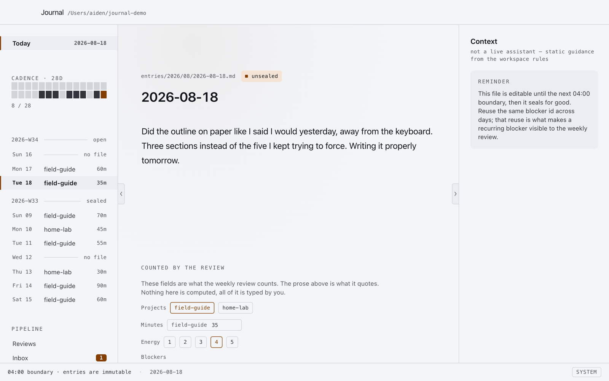
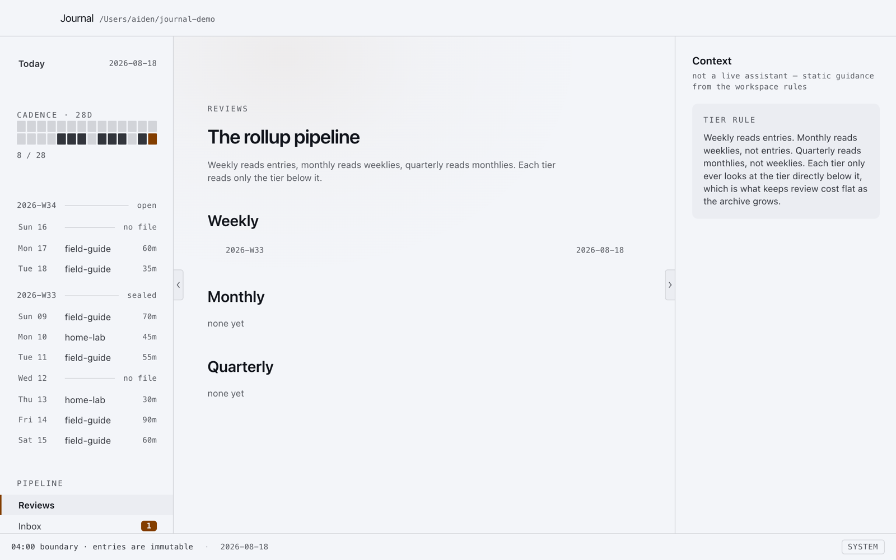
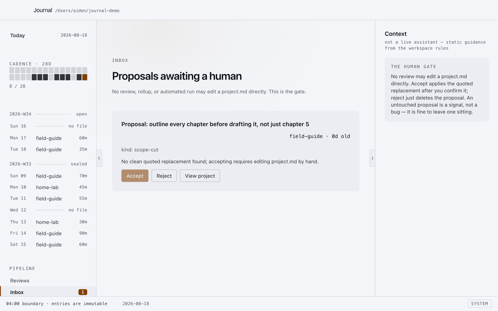
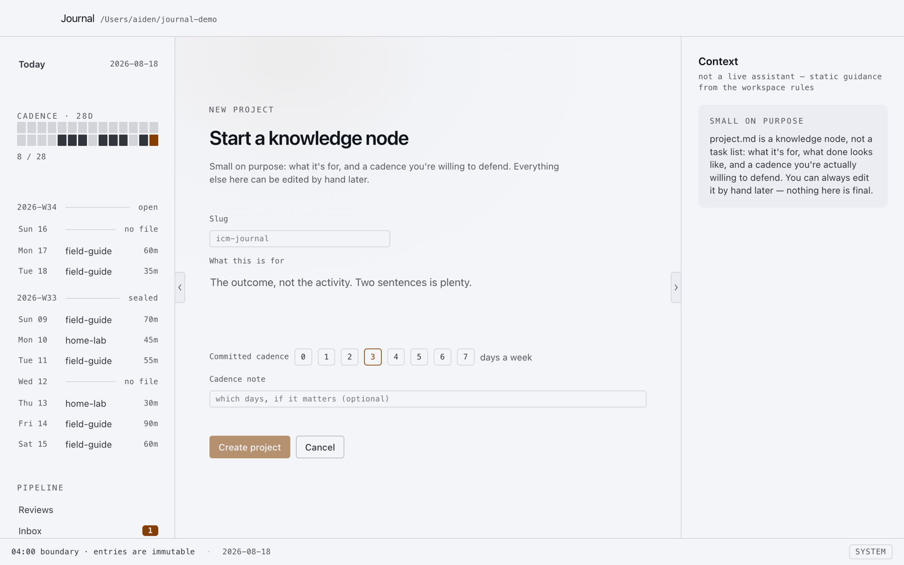

<div align="center">

<picture>
  <source media="(prefers-color-scheme: dark)" srcset=".github/readme/banner-dark.png">
  
</picture>

<br><br>


**A local, single-user journaling desktop app.**
Entries accumulate as markdown files on your own disk.
Nothing here is a database, nothing here edits the past, and nothing here talks to a server.

</div>

---

Built on ICM (Interpretable Context Methodology) conventions: folders carry sequencing, hierarchy carries context, files carry state.
The method (schema, contracts, templates) lives in `_system/`, inside the workspace this app creates for you.
If something needs explaining, the explanation is in that folder's `CONTEXT.md`.

## What this is

A journal day runs 04:00 to 04:00 local time, not midnight to midnight.
Write freely in a plain-text entry with a small set of typed fields (projects touched, minutes, energy, blockers, what shipped).
At the next 04:00 boundary, the day's file seals: it can never be edited again, only corrected by a new dated file that says what you now believe instead.
A missing day is a skipped day.
There is no streak counter to fall out of sync with, because the filesystem already is the record.

Reviews (weekly, monthly, quarterly) are produced separately by reading that record; this app writes entries, shows you reviews once they exist, and gives you a gate to accept or reject anything a review proposes about a project.
It never writes a review and never edits a project file on its own.

## A look around

<table>
<tr>
<td width="50%">

**Today**
The 28-day cadence rail, the sealing boundary, and the fields the review pipeline actually reads.



</td>
<td width="50%">

**Reviews**
Weekly reads entries, monthly reads weeklies, quarterly reads monthlies. Each tier reads only the one below it.



</td>
</tr>
<tr>
<td width="50%">

**Inbox**
A review can propose a change to a project. It can never make the change. Accept or reject is the one lever a human keeps.



</td>
<td width="50%">

**New project**
Small on purpose: what it's for, and a cadence you're willing to defend. Everything else can be edited by hand later.



</td>
</tr>
</table>

## Get started

Requires [Node.js](https://nodejs.org) 20+.

```bash
git clone https://github.com/aidenwong04/journal.git
cd journal
npm install
npm start
```

The first time it opens, pick a folder for your journal (defaults to `~/journal`).
An empty folder gets scaffolded from the `template/` in this repo; an existing journal folder is used as-is.
Your entries live in that folder, not in this repository.

To build a distributable app (`.dmg` / `.exe` / `.AppImage`):

```bash
npm run dist
```

## What's implemented

- Writing and saving today's entry, with the fields the review pipeline reads
- The 04:00 sealing boundary, checked live while the app is open, no restart needed
- Corrections: editing a sealed day writes a new dated file instead, and the original is never touched
- Schema validation on save (a native port of `_system/scripts/check-entries.sh`)
- The project picker (only real projects are selectable) and blocker-id autocomplete across the last few weeks
- A navigation rail with a 28-day cadence readout, the current and previous week broken out by day, and the review pipeline and project list below it
- Creating a new project from the UI, end to end
- The inbox: reviewing, accepting, or rejecting proposals a review has written to a project's `_inbox/`
- Read-only rendering of any reviews already on disk under `reviews/*/output/`

## What's not (yet)

- **Voice capture.** Deferred by design; see `_system/voice-cleanup.md`. The schema and validation for `source: voice` entries are already in place, so a voice entry created another way is still legal.
- **Review generation.** This app never writes to `reviews/`. Reviews are produced by having an LLM agent (this was built and tested against Claude Code) read `reviews/*/CONTEXT.md` and follow it; see `_system/scripts/CONTEXT.md` for the exact invocation.
- **Command palette.** The design system (`_system/ui-design-spec.md`) specifies a ⌘K command palette; the current shell relies on the rail instead.

## Architecture

```
electron/     main process - the only code that touches the filesystem
src/          renderer - React + the Midnight design system
template/     the ICM workspace skeleton, copied into a fresh journal folder on first run
tests/        domain-layer tests, including a round trip through the real check-entries.sh
```

The renderer never gets direct filesystem access (`contextIsolation: true`, `nodeIntegration: false`).
Everything it can do is listed in one file, `electron/api-types.ts`, exposed through `electron/preload.ts`.
That is what makes "the UI can only write to `entries/`, plus an explicit accepted proposal" an enforced property rather than a convention.

The design system in `src/styles/app.css` is lifted verbatim from a working HTML prototype; see `template/_system/ui-design-spec.md` for the token reference (color, type, space, sizing ratios, motion) that any future UI work should be checked against.

## Development

```bash
npm test          # domain-layer tests (vitest)
npm run typecheck # both the renderer and main-process TypeScript projects
npm run electron:dev  # app with hot reload
```

## License

MIT, see `LICENSE`.
